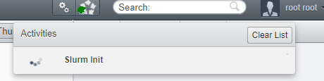
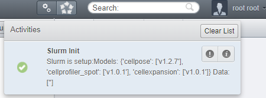

# Google Cloud Slurm tutorial

## Introduction

This library is meant to be used with some external HPC cluster using Slurm, to offload your (OMERO) compute to servers suited for it.

However, if you don't have ready access (yet) to such a cluster, you might want to spin some test environment up in the Cloud and connect your (local) OMERO to it. 
This is what we will cover in this tutorial, specifically Google Cloud.

## 0. Requirements

To follow this tutorial, you need:
- Git
- Docker
- OMERO Insight
- A creditcard (but we'll work with free credits)

I use Windows here, but it should work on Linux/Mac too. If not, let me know.

I provide ready-to-go TL;DR, but in the details of each chapter I walk through the steps I took to make these containers ready.


## 1. Setup Google Cloud for Slurm

### TL;DR:
1. Follow this [tutorial](https://cloud.google.com/hpc-toolkit/docs/quickstarts/slurm-cluster) from Google Cloud. Click 'guide me'.
2. Make a new Google Account to do this, with free $300 credits to use Slurm for a bit. This requires the creditcard (but no cost).


<details>
  <summary>Details</summary>

So, we follow this [tutorial](https://cloud.google.com/hpc-toolkit/docs/quickstarts/slurm-cluster) and end up with a `hpcsmall` VM on Google Cloud.

</details>

However, we are missing an ingredient: SSH access!

## 2. Add SSH access

### TL;DR:
1. Add your public SSH key (`~/.ssh/id_rsa.pub`) to the Google Cloud instance, like [here](https://cloud.google.com/compute/docs/connect/add-ssh-keys?cloudshell=true#gcloud). Easiest is with Cloud shell, upload your public key, and run `gcloud compute os-login ssh-keys add    --key-file=id_rsa.pub`
2. Turn the [firewall](https://console.cloud.google.com/net-security/firewall-manager/firewall-policies/list) setting (e.g. `hpc-small-net-fw-allow-iap-ingress`) to allow `0.0.0.0/0` as IP ranges for `tcp:22`.
3. Promote the login node's IP address to a static one: [here](https://cloud.google.com/compute/docs/ip-addresses/reserve-static-external-ip-address#promote_ephemeral_ip)
4. Copy that IP and your username.
5. On your own computer, add a SSH config file, store it as `~/.ssh/config` (no extension) with the ip and user filled in:

```yaml
Host gcslurm
	HostName <fill-in-the-External-IP-of-VM-instance>
	User <fill-in-your-Google-Cloud-user>
	Port 22
	IdentityFile ~/.ssh/id_rsa
```

<details>
  <summary>Details</summary>

We need to setup our library with SSH access between OMERO and Slurm, but this is not built-in to these Virtual Machines yet.
We will forward our local SSH to our OMERO (in this tutorial), so we just need to setup SSH access to the Google Cloud VMs.

This sounds easier than it actually is.

Follow the steps at [here](https://cloud.google.com/compute/docs/connect/add-ssh-keys?cloudshell=true#gcloud):

0. Note that this tutorial by default seems to use the "OS Login" method, using the mail account you signed up with.
1. Open a Cloud Shell
2. Upload your public key to this Cloud Shell (with the `...` button).
3. Run the `gcloud compute os-login ssh-keys add    --key-file=id_rsa.pub` command they show, pointing at your newly uploaded public key. Leave out the optional `project` and `expire_time`.

Then, we have to ensure that the firewall accepts requests from outside Google Cloud, if it doesn't already. 

Go to the [firewall](https://console.cloud.google.com/net-security/firewall-manager/firewall-policies/list) settings and edit the tcp:22 (e.g. `hpc-small-net-fw-allow-iap-ingress`) and add the `0.0.0.0/0` ip ranges.

Now we are ready:
- `ssh -i ~/.ssh/id_rsa <fill-in-your-Google-Cloud-user>@<fill-in-the-External-IP-of-VM-instance>`

E.g. my Google Cloud user became `t_t_luik_amsterdamumc_nl`, related to the email I signed up with.
The External IP was on the [VM instances](https://console.cloud.google.com/compute/instances) page for the login node `hpcsmall-login-2aoamjs0-001`.

Now to make this connection easy, we need 2 steps:
1. Fix this external IP address, so that it will always be the same
2. Fix a SSH config file for this SSH connection

For 1, we got to [here](https://cloud.google.com/compute/docs/ip-addresses/reserve-static-external-ip-address#promote_ephemeral_ip) and follow the Console steps to promote the IP address to a static IP address. Now back in the `All` screen, your newly named Static IP address should show up. Copy that IP (it should be the same IP as before, but now it will not change when you restart the system)

For 2, On your own computer, add a SSH config file, store it as `~/.ssh/config` (no extension) with the ip and user filled in:

```yaml
Host gcslurm
	HostName <fill-in-the-External-IP-of-VM-instance>
	User <fill-in-your-Google-Cloud-user>
	Port 22
	IdentityFile ~/.ssh/id_rsa
```

Now you should be able to login with a simple: `ssh gcslurm`.


Congratulations!

</details>


## 3. Test Slurm

### TL;DR:
1. SSH into the login node: `ssh gcslurm`
3. Start some filler jobs: `sbatch --wrap="sleep 5 && hostname" &&  sbatch --wrap="sleep 5 && hostname" &&  sbatch --wrap="sleep 5 && hostname" &&  sbatch --wrap="sleep 5 && hostname"`
4. Check the progress: `squeue` 
5. Check some output when its done, e.g. job 1: `cat slurm-1.out`

<details>
  <summary>Details</summary>

Now connect via SSH to Google Cloud Slurm and let's see if Slurm works:
```bash
[t_t_luik_amsterdamumc_nl@hpcsmall-login-2aoamjs0-001 ~]$ squeue
             JOBID PARTITION     NAME     USER ST       TIME  NODES NODELIST(REASON)
[t_t_luik_amsterdamumc_nl@hpcsmall-login-2aoamjs0-001 ~]$ sbatch --wrap="sleep 5 && hostname" &&  sbatch --wrap="sleep 5 && hostname" &&  sbatch --wrap="sleep 5 && hostname" &&  sbatch --wrap="sleep 5 && hostname"
Submitted batch job 4
Submitted batch job 5
Submitted batch job 6
Submitted batch job 7
[t_t_luik_amsterdamumc_nl@hpcsmall-login-2aoamjs0-001 ~]$ squeue
             JOBID PARTITION     NAME     USER ST       TIME  NODES NODELIST(REASON)
                 4     debug     wrap t_t_luik CF       0:03      1 hpcsmall-debug-ghpc-3
                 5     debug     wrap t_t_luik PD       0:00      1 (Resources)
                 6     debug     wrap t_t_luik PD       0:00      1 (Priority)
                 7     debug     wrap t_t_luik PD       0:00      1 (Priority)
```

I fired off 4 jobs that take some seconds, so they are still in the queue by the time I call the `squeue`. Note that the first one might take a while since Google Cloud has to fire up a new compute node for the first time.

The jobs wrote their stdout output in the current dir:
```bash
[t_t_luik_amsterdamumc_nl@hpcsmall-login-2aoamjs0-001 ~]$ ls
slurm-4.out  slurm-5.out  slurm-6.out  slurm-7.out
[t_t_luik_amsterdamumc_nl@hpcsmall-login-2aoamjs0-001 ~]$ squeue
             JOBID PARTITION     NAME     USER ST       TIME  NODES NODELIST(REASON)
[t_t_luik_amsterdamumc_nl@hpcsmall-login-2aoamjs0-001 ~]$ cat slurm-4.out
hpcsmall-debug-ghpc-3
[t_t_luik_amsterdamumc_nl@hpcsmall-login-2aoamjs0-001 ~]$ cat slurm-5.out
hpcsmall-debug-ghpc-3
```

All on the same node that was spun up, on-demand, by Google Cloud. You should be able to see it still alive in the `VM instances` [tab](https://console.cloud.google.com/compute/instances) as well. It will be destroyed again if not used for a while, saving you costs.

</details>

## 3b. Install requirements: Singularity / Apptainer and 7zip

### TL;DR:
1. Follow this [guide](https://cloud.google.com/architecture/deploying-containerized-workloads-slurm-cluster-compute-engine) to install Singularity, but in step 5 please install in `/opt/apps` ! `/apps` is not actually shared with all nodes.
2. Execute the following to update `~/.bashrc`:

```
echo 'export PATH=/apps/singularity/3.8.7/bin:/usr/sbin:${PATH}' >> ~/.bashrc && source ~/.bashrc
```
3. Install 7zip: `sudo yum install -y p7zip p7zip-plugins`

<details>

Now we want to run containers on our Slurm cluster using `singularity`, but this is not installed by default.

Luckily the folks at Google have a [guide](https://cloud.google.com/architecture/deploying-containerized-workloads-slurm-cluster-compute-engine) for it, so let's follow that one.

If the ssh connection to the login node doesn't work from Google Cloud Shell, you can continue with the steps by using the SSH connection (`ssh gcslurm`) that we just built from your local commandline.

Use this URL for the singularity tar:

`https://github.com/apptainer/singularity/releases/download/v3.8.7/singularity-3.8.7.tar.gz`

```bash
wget https://github.com/apptainer/singularity/releases/download/v3.8.7/singularity-3.8.7.tar.gz && tar -xzf singularity-${SINGULARITY_VERSION}.tar.gz && cd singularity-${SINGULARITY_VERSION}
```

The module step did not work for me, because it is the wrong directory in the guide!

In step 5, we need to install to `/opt/apps` instead! This is very important because the compute nodes that have to execute the job need to have access to this software too, and this directory is the actual shared directory:

```bash
./mconfig --prefix=/opt/apps/singularity/${SINGULARITY_VERSION} && \
    make -C ./builddir && \
    sudo make -C ./builddir install
```

Now `module avail` should list `singularity`.

So `module load singularity` and now `singularity --version` should give you `singularity version 3.8.7`.

</details>

Now let's connect OMERO to our Slurm!

## 4. OMERO & OMERO Slurm Client

Ok, now we need a OMERO server and a correctly configured OMERO Slurm Client.

### TL;DR:
1.  Clone my example `docker-example-omero-grid-amc` locally: `git clone -b processors https://github.com/TorecLuik/docker-example-omero-grid-amc.git`
2. Change the `worker-gpu/slurm-config.ini` file to point to `worker-gpu/slurm-config.gcslurm.ini` file (if it is not the same file already)
3. Fire up the OMERO containers: `docker-compose up -d --build`
4. Go to OMERO.web (`localhost:4080`), login `root` pw `omero`
5. Upload some images (to `localhost`) with OMERO.Insight (not included).
6. In web, run the `slurm/init_environment` script

<details>
  <summary>Details</summary>

======= OMERO in Docker =======

You can use your own OMERO setup, but for this tutorial I will refer to a dockerized OMERO that I am working with: [get it here](https://github.com/TorecLuik/docker-example-omero-grid-amc/tree/processors).

```bash
git clone -b processors https://github.com/TorecLuik/docker-example-omero-grid-amc.git
```

Change the `worker-gpu/slurm-config.ini` file to be the `worker-gpu/slurm-config.gcslurm.ini` file (if it is not the same file already).

What we did was point to `gcslurm` profile (or rename your SSH profile to `slurm`)
```ini
[SSH]
# -------------------------------------
# SSH settings
# -------------------------------------
# The alias for the SLURM SSH connection
host=gcslurm
```

And we also set all directories to be relative to the home dir, and we reduced CellPose CPU drastically to fit into the small Slurm cluster we made in Google Cloud.

This way, it will use the right SSH setting to connect with our Google Cloud Slurm.


Let's (build it and) fire it up:

```bash
docker-compose up -d --build
```

======= OMERO web =======

Once they are running, you should be able to access web at `localhost:4080`. Login with user `root` / pw `omero`. 

Import some example data with OMERO Insight (connect with `localhost`).

======= Connect to Slurm =======

This container's processor node (`worker-5`) has already installed our `omero-slurm-client` library. 

======= Add ssh config to OMERO Processor =======

Ok, so SSH works fine from your machine, but we need the OMERO processing server `worker-5` to be able to do it too.

By some smart tricks, we have mounted our `~/.ssh` folder to the worker container, so it knows and can use our SSH settings and config.

Ok, so now we can connect from within the worker-5 to our Slurm cluster. We can try it out:
```powershell
...\docker-example-omero-grid> docker-compose exec omeroworker-5 /bin/bash
bash-4.2$ ssh gcslurm

<pretty-slurm-art>

[t_t_luik_amsterdamumc_nl@hpcsmall-login-2aoamjs0-001 ~]$ squeue
             JOBID PARTITION     NAME     USER ST       TIME  NODES NODELIST(REASON)
```

======= Init environment =======

Now we go to OMERO web and run the `slurm/init_environment` script to apply this config and setup our Slurm. We will use the default location, no need to fill in anything, just run the script.





</details>

Note, this will take a while, since it is downloading workflow docker images and building (singularity) containers from them. 

Congratulations! We have setup workflows CellPose `v1.2.7`, Cellprofiler Spot `v1.0.1` and CellExpansion `v1.0.1`. And there are no data files yet.

Let's go run some segmentation workflow then!

## 5. Workflows!

### TL;DR:
1. In web, select your images and run script `slurm/SLURM Run Workflow`
    - Tick off `E-mail` box (not implemented in this Slurm docker setup)
    - For importing results, change `3a) Import into NEW Dataset` to `CellPose_Masks`
    - For importing results, change `3b) Rename the imported images` to `{original_file}_cpmask.{ext}`
    - Select `cellpose`, but tick off `use_gpu` off (sadly not implemented in this docker setup)
    - Click `Run Script`
2. Now go get a coffee or something, it should take a lot of minutes (about 12m:30s for 4 256x256 images for me!) and then say (a.o.): `COMPLETE`
    - Or it `FAILED`, in which case you should check all the details anyway and get your hands dirty with debugging! Or try less and smaller images.
3. Refresh your Explore window, there should be a new dataset `CellPose_Masks` with a mask for every input image. 

<details>
  <summary>Details</summary>

So, I hope you added some data already; if not, import some images now.

Let's run `slurm/SLURM Run Workflow`:


You can see that this script recognized that we downloaded 3 workflows, and what their parameters are. For more information on this magic, follow the other tutorials.

Let's select `cellpose` and click `use gpu` off (sadly). Tune the other parameters as you like for your images. Also, for output let's select `Import into NEW Dataset` by filling in a dataset name: cellpose_images. Click `Run Script`.


This will take ages because we did not invest in good compute on the Slurm cluster. It took 12m:30s for 4 small images for me.

You can check the progress with the `Slurm Get Update` script.

</details>

That should take you through connecting OMERO with a Google Cloud Slurm setup!


