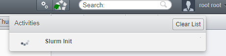

# Local Slurm tutorial

## Introduction

This library is meant to be used with some external HPC cluster using Slurm, to offload your (OMERO) compute to servers suited for it.

However, if you don't have ready access (yet) to such a cluster, you might want to spin some test environment up locally and connect your (local) OMERO to it. 
This is what we will cover in this tutorial.

## 0. Requirements

To follow this tutorial, you need:
- Git
- Docker
- OMERO Insight
- \> 18GB memory
- \> 8 CPU cores

I use Windows here, but it should work on Linux/Mac too. If not, let me know.

System requirements could be less, but then you have to change some configurations for Slurm.

I provide ready-to-go TL;DR, but in the details of each chapter I walk through the steps I took to make these containers ready.

## 1. Setup Docker containers for Slurm

### TL;DR:
- Clone my example `slurm-docker-cluster` locally: [here](https://github.com/TorecLuik/slurm-docker-cluster)


<details>
  <summary>Details</summary>

Always a good idea to stand on the shoulders of giants, so we want to spin up a ready-made Slurm container cluster. [Here on Github](https://github.com/giovtorres/slurm-docker-cluster) is a nice example with a open source license. It uses [Docker](https://www.docker.com/) containers and [Docker Compose](https://docs.docker.com/compose/) to easily orchestrate their interactions.

This setup will spin up a few separate containers (on the same computer) to make 1 slurm cluster:
- `slurmdbd`, the Slurm DataBase Daemon
- `slurmctld`, the Slurm Control Daemon, our entrypoint
- `mysql`, the actual database
- `c1` and `c2`, 2 compute nodes

Note: these compute nodes are not setup to use GPU, that is a whole other challenge that we will not get into. But even on CPU, Slurm can be useful for parallel processing and keeping track of a queue of jobs.

So let's clone this [repository](https://github.com/giovtorres/slurm-docker-cluster) to our local system:

```sh
git clone https://github.com/giovtorres/slurm-docker-cluster.git .
```

You can build and run these containers as described in their [README](https://github.com/giovtorres/slurm-docker-cluster/blob/master/README.md). Then you can already play around with Slurm that way, so try it out!
</details>

However, we are missing an ingredient: SSH access!

## 2. Add SSH access

### TL;DR:
1. Copy your public SSH key (`id_rsa.pub`) into this git folder (it will get copied into the Docker image when you build it)
2. Add a SSH config file, store it as `~/.ssh/config` (no extension):

```yaml
Host localslurm
	HostName host.docker.internal
	User slurm
	Port 2222
	IdentityFile ~/.ssh/id_rsa
	StrictHostKeyChecking no
```

<details>
  <summary>Details</summary>

We need to setup our library with SSH access between OMERO and Slurm, but this is not built-in to these containers yet (because Docker actually has a built-in alternative, `docker exec`).

Luckily, people have already worked on SSH access into containers too, like [here](https://goteleport.com/blog/shell-access-docker-container-with-ssh-and-docker-exec/). So let's borrow their OpenSSH setup and add it to the _Dockerfile_ of the Slurm Control Daemon (`slurmctld`):

======= 2a. Make a new Dockerfile for the slurmctld =======

We want to combine the 2 Dockerfiles. However, one is `ubuntu` and the other is `rockylinux`. The biggest difference is that `rockylinux` uses the `yum` package manager to install software, instead of `apt`. We will stick to the Slurm image as the base image and just add the OpenSSH on top of it. 

Turns out, another difference is the use of `systemctld` causing all kinds of issues. 
So I spent the time to activate OpenSSH server on Rocky linux:

```dockerfile
FROM rockylinux:8

... # all the Slurm stuff from original Dockerfile ... 

## ------- Setup SSH ------
RUN yum update && yum install  openssh-server initscripts sudo -y
# Create a user “sshuser” and group “sshgroup”
# RUN groupadd sshgroup && useradd -ms /bin/bash -g sshgroup sshuser
# Create sshuser directory in home
RUN mkdir -p /home/slurm/.ssh
# Copy the ssh public key in the authorized_keys file. The idkey.pub below is a public key file you get from ssh-keygen. They are under ~/.ssh directory by default.
COPY id_rsa.pub /home/slurm/.ssh/authorized_keys
# change ownership of the key file. 
RUN chown slurm:slurm /home/slurm/.ssh/authorized_keys && chmod 600 /home/slurm/.ssh/authorized_keys
# Start SSH service
# RUN service ssh start
# RUN /etc/init.d/sshd start
RUN /usr/bin/ssh-keygen -A
# Expose docker port 22
EXPOSE 22
CMD ["/usr/sbin/sshd","-D"]
# CMD ["slurmdbd"]
```
We have replaced the `slurmdbd` command (CMD) with our setup from `sshdocker`, starting a ssh daemon (`sshd`) with our SSH public key associated to the `slurm` user
. 
This last part is important: to build this new version, you need to copy your public SSH key into this Docker image. 
This is performed in this line:
```dockerfile
# Copy the ssh public key in the authorized_keys file. The idkey.pub below is a public key file you get from ssh-keygen. They are under ~/.ssh directory by default.
COPY id_rsa.pub /home/<user>/.ssh/authorized_keys
```
So, you need to add your `id_rsa.pub` public key to this directory, so Docker can copy it when it builds the image.

Turns out, we also need to change the entrypoint script:

```sh
... # other stuff from script

if [ "$1" = "slurmctld" ]
then
    echo "---> Starting the MUNGE Authentication service (munged) ..."
    gosu munge /usr/sbin/munged

    echo "---> Starting SSH Daemon (sshd) ..."
    # exec /usr/bin/ssh-keygen -A
    exec /usr/sbin/sshd -D &
    exec rm /run/nologin &
    exec chmod 777 /data &

    echo "---> Waiting for slurmdbd to become active before starting slurmctld ..."

    ... # other stuff from script
```

We added the command to start the SSH daemon on the CTLD here, where it is actually called.
We also added some quick bugfixes to make the tutorial SSH work.
If you still run into issues with permissions in `/data`, login as superuser and also apply write access again.

======= 2b. Tell Docker Compose to use the new Dockerfile for `slurmctld` =======

Currently, [Docker Compose](https://github.com/giovtorres/slurm-docker-cluster/blob/master/docker-compose.yml) will spin up all containers from the same Dockerfile definition.

So we will change the Dockerfile for the `slurmctld` as defined in the `docker-compose.yml`, by replacing `image` with `build`:

```yml
slurmctld:
    # image: slurm-docker-cluster:${IMAGE_TAG:-21.08.6}
    # Build this image from current folder
    # Use a specific file: Dockerfile_slurmctld
    build: 
      context: ./
      dockerfile: Dockerfile_slurmctld
    command: ["slurmctld"]
    container_name: slurmctld
    hostname: slurmctld
    volumes:
      - etc_munge:/etc/munge
      - etc_slurm:/etc/slurm
      - slurm_jobdir:/data
      - var_log_slurm:/var/log/slurm
    expose:
      - "6817"
    ports:
      - "2222:22"
    depends_on:
      - "slurmdbd"
```

We also mapped port 22 (SSH) from the container to our localhost port 2222.
So now we can connect SSH to our localhost and be forwarded to this Slurm container.


Test it out:

1. Fire up the Slurm cluster:
```powershell
docker-compose up -d --build
```

2. SSH into the control node:
```powershell
ssh -i C:\Users\<you>\.ssh\id_rsa slurm@localhost -p 2222 -o UserKnownHostsFile=/dev/null
```

This should connect as the `slurm` user to the control container on port 2222 (type yes to connect, we will fix promptless login later).

```shell
Last login: Tue Aug  8 15:48:31 2023 from 172.21.0.1
[slurm@slurmctld ~]$
```

Congratulations!

======= 2c. Add SSH config for simple login =======

But, we can simplify the SSH, and our library needs a simple way to login.

For this, add [this](../example.config) config file as your `~/.ssh/config`, no extension. See [here](https://www.ssh.com/academy/ssh/config) for more information.

Of course, first update the values with those you used to SSH before, e.g.:
```ini
Host slurm
	HostName localhost
	User slurm
	Port 2222
	IdentityFile ~/.ssh/id_rsa
	StrictHostKeyChecking no
```

Then try it out:
`ssh slurm`

======= StrictHostKeyChecking =======
Note that I added `StrictHostKeyChecking no`, as our Slurm container will have different keys all the time. A normal Slurm server likely does not, and won't require this flag. This is also where we get our pretty warning from:
```
...> ssh slurm
@@@@@@@@@@@@@@@@@@@@@@@@@@@@@@@@@@@@@@@@@@@@@@@@@@@@@@@@@@@
@    WARNING: REMOTE HOST IDENTIFICATION HAS CHANGED!     @
@@@@@@@@@@@@@@@@@@@@@@@@@@@@@@@@@@@@@@@@@@@@@@@@@@@@@@@@@@@
IT IS POSSIBLE THAT SOMEONE IS DOING SOMETHING NASTY!
Someone could be eavesdropping on you right now (man-in-the-middle attack)!
It is also possible that a host key has just been changed.
```
The host key changed =)

If you don't add this flag, it will safe you from danger and deny access. Of course, that is not very useful for our tutorial.

</details>


## 3. Test Slurm

### TL;DR:
1. Spin up the Slurm cluster: `docker-compose up -d --build`
2. SSH into the control node: `ssh localslurm`
3. Start some filler jobs: `sbatch --wrap="sleep 5 && hostname" &&  sbatch --wrap="sleep 5 && hostname" &&  sbatch --wrap="sleep 5 && hostname" &&  sbatch --wrap="sleep 5 && hostname"`
4. Check the progress: `squeue` 
5. Check some output, e.g. job 1: `cat slurm-1.out`

<details>
  <summary>Details</summary>

Now connect via SSH to Slurm, change to `/data` (our fileserver shared between the Slurm nodes) and let's see if Slurm works:
```bash
[slurm@slurmctld ~]$ cd /data
[slurm@slurmctld data]$ squeue
             JOBID PARTITION     NAME     USER ST       TIME  NODES NODELIST(REASON)
[slurm@slurmctld data]$
```
The queue is empty!
Let's fill it up with some short tasks:
```bash
[slurm@slurmctld data]$ sbatch --wrap="sleep 5 && hostname" &&  sbatch --wrap="sleep 5 && hostname" &&  sbatch --wrap="sleep 5 && hostname" &&  sbatch --wrap="sleep 5 && hostname"
Submitted batch job 5
Submitted batch job 6
Submitted batch job 7
Submitted batch job 8
[slurm@slurmctld data]$ squeue
             JOBID PARTITION     NAME     USER ST       TIME  NODES NODELIST(REASON)
                 7    normal     wrap    slurm  R       0:01      1 c1
                 8    normal     wrap    slurm  R       0:01      1 c2
[slurm@slurmctld data]$
```
I fired off 4 jobs that take 2 seconds, so a few remained in the queue by the time I called for an update. You can also see they split over the 2 compute nodes `c1` and `c2`.

The jobs wrote their stdout output in the current dir (`/data`, which is where permission issues might come in):
```bash
[slurm@slurmctld data]$ ls
slurm-3.out  slurm-4.out  slurm-5.out  slurm-6.out  slurm-7.out  slurm-8.out
[slurm@slurmctld data]$ cat slurm-7.out
c1
[slurm@slurmctld data]$ cat slurm-8.out
c2
[slurm@slurmctld data]$
```

</details>

They logged the `hostname` command, which returned `c1` for some and `c2` for others, as those were the hosts the compute was used from.

Now let's connect OMERO to our Slurm!

## 4. OMERO & OMERO Slurm Client

Ok, now we need a OMERO server and a correctly configured OMERO Slurm Client.

### TL;DR:
1.  Clone my example `docker-example-omero-grid-amc` locally: `git clone -b processors https://github.com/TorecLuik/docker-example-omero-grid-amc.git`
2. Fire up the OMERO containers: `docker-compose up -d --build`
3. Go to OMERO.web (`localhost:4080`), login `root` pw `omero`
4. Upload some images (to `localhost`) with OMERO.Insight (e.g. [Cells.tiff](https://github.com/NL-BioImaging/omero-slurm-client/blob/main/resources/tutorials/images/Cells.tif)).
5. In web, run the `slurm/init_environment` script ([here](https://github.com/NL-BioImaging/omero-slurm-scripts/blob/master/init/SLURM_Init_environment.py))

<details>
  <summary>Details</summary>

======= OMERO in Docker =======

You can use your own OMERO setup, but for this tutorial I will refer to a dockerized OMERO that I am working with: [get it here](https://github.com/TorecLuik/docker-example-omero-grid-amc/tree/processors).

```bash
git clone -b processors https://github.com/TorecLuik/docker-example-omero-grid-amc.git
```

Let's (build it and) fire it up:

```bash
docker-compose up -d --build
```

======= OMERO web =======

Once they are running, you should be able to access web at `localhost:4080`. Login with user `root` / pw `omero`. 

Import some example data with OMERO Insight (connect with `localhost`).

======= Connect to Slurm =======

This container's processor node (`worker-5`) has already installed our `omero-slurm-client` library. 

======= Add ssh config to OMERO Processor =======

Ok, so `localhost` works fine from your machine, but we need the OMERO processing server `worker-5` to be able to do it too, like [we did before](#2c-add-ssh-config-for-simple-login).

By some smart tricks, we have mounted our `~/.ssh` folder to the worker container, so it knows and can use our SSH settings and config.

However, we need to change the `HostName` to match one that the container can understand. `localhost` works fine from our machine, but not from within a Docker container. Instead, we need to use `host.docker.internal` ([documentation](https://docs.docker.com/desktop/networking/#i-want-to-connect-from-a-container-to-a-service-on-the-host)).

```ini
Host slurm
	HostName host.docker.internal
	User slurm
	Port 2222
	IdentityFile ~/.ssh/id_rsa
	StrictHostKeyChecking no
```

Restart your OMERO cluster if you already started it:
`docker-compose down` & `docker-compose up -d --build`

Ok, so now we can connect from within the worker-5 to our Slurm cluster. We can try it out:
```powershell
...\docker-example-omero-grid> docker-compose exec omeroworker-5 /bin/bash
bash-4.2$ ssh slurm
Last login: Wed Aug  9 13:08:54 2023 from 172.21.0.1
[slurm@slurmctld ~]$ squeue
             JOBID PARTITION     NAME     USER ST       TIME  NODES NODELIST(REASON)
[slurm@slurmctld ~]$ exit
logout
Connection to host.docker.internal closed.
bash-4.2$ exit
exit
```

======= slurm-config.ini =======
 
Let us setup the library's config file [slurm-config.ini](../slurm-config.ini) correctly.

Now, the `omero-slurm-client` library by default expects the `Slurm` ssh connection to be called `slurm`, but you can adjust it to whatever you named your ssh _Host_ in config. 

In this Docker setup, the config file is located at the `worker-gpu` folder and in the Dockerfile it is copied to `/etc/`, where the library will pick it up.

Let's use these values:

```ini
[SSH]
# -------------------------------------
# SSH settings
# -------------------------------------
# The alias for the SLURM SSH connection
host=slurm
# Set the rest of your SSH configuration in your SSH config under this host name/alias
# Or in e.g. /etc/fabric.yml (see Fabric's documentation for details on config loading)

[SLURM]
# -------------------------------------
# Slurm settings
# -------------------------------------
# General settings for where to find things on the Slurm cluster.
# -------------------------------------
# PATHS
# -------------------------------------
# The path on SLURM entrypoint for storing datafiles
#
# Note: 
# This example is relative to the Slurm user's home dir
slurm_data_path=/data/my-scratch/data
# The path on SLURM entrypoint for storing container image files
#
# Note: 
# This example is relative to the Slurm user's home dir
slurm_images_path=/data/my-scratch/singularity_images/workflows
# The path on SLURM entrypoint for storing the slurm job scripts
#
# Note: 
# This example is relative to the Slurm user's home dir
slurm_script_path=/data/my-scratch/slurm-scripts
```

We have put all the storage paths on `/data/my-scratch/` and named the SSH Host connection `slurm`.

The other values we can keep as [default](../slurm-config.ini), except we don't have a GPU, so let's turn that off for CellPose:

```ini
# -------------------------------------
# CELLPOSE SEGMENTATION
# -------------------------------------
# The path to store the container on the slurm_images_path
cellpose=cellpose
# The (e.g. github) repository with the descriptor.json file
cellpose_repo=https://github.com/TorecLuik/W_NucleiSegmentation-Cellpose/tree/v1.2.7
# The jobscript in the 'slurm_script_repo'
cellpose_job=jobs/cellpose.sh
# Override the default job values for this workflow
# Or add a job value to this workflow
# For more examples of such parameters, google SBATCH parameters.
# If you don't want to override, comment out / delete the line.
# Run CellPose Slurm with 10 GB GPU
# cellpose_job_gres=gpu:1g.10gb:1
# Run CellPose Slurm with 15 GB CPU memory
cellpose_job_mem=15GB
```

The `gres` will request a 10GB GPU on the Slurm cluster, but we only set up CPU docker slurm.

We will also comment out some of the other algorithms, so we have to download less containers to our Slurm cluster and speed up the tutorial.

This brings us to the following configuration file:


```ini
[SSH]
# -------------------------------------
# SSH settings
# -------------------------------------
# The alias for the SLURM SSH connection
host=slurm
# Set the rest of your SSH configuration in your SSH config under this host name/alias
# Or in e.g. /etc/fabric.yml (see Fabric's documentation for details on config loading)

[SLURM]
# -------------------------------------
# Slurm settings
# -------------------------------------
# General settings for where to find things on the Slurm cluster.
# -------------------------------------
# PATHS
# -------------------------------------
# The path on SLURM entrypoint for storing datafiles
#
# Note: 
# This example is relative to the Slurm user's home dir
slurm_data_path=/data/my-scratch/data
# The path on SLURM entrypoint for storing container image files
#
# Note: 
# This example is relative to the Slurm user's home dir
slurm_images_path=/data/my-scratch/singularity_images/workflows
# The path on SLURM entrypoint for storing the slurm job scripts
#
# Note: 
# This example is relative to the Slurm user's home dir
slurm_script_path=/data/my-scratch/slurm-scripts
# -------------------------------------
# REPOSITORIES
# -------------------------------------
# A (github) repository to pull the slurm scripts from.
#
# Note: 
# If you provide no repository, we will generate scripts instead!
# Based on the job_template and the descriptor.json
#
# Example:
#slurm_script_repo=https://github.com/TorecLuik/slurm-scripts
slurm_script_repo=
# -------------------------------------
# Processing settings
# -------------------------------------
# General/default settings for processing jobs.
# Note: NOT YET IMPLEMENTED
# Note: If you need to change it for a specific case only,
# you should change the job script instead, either in OMERO or Slurm 


[MODELS]
# -------------------------------------
# Model settings
# -------------------------------------
# Settings for models/singularity images that we want to run on Slurm
#
# NOTE: keys have to be unique, and require a <key>_repo and <key>_image value as well.
#
# NOTE 2: Versions for the repo are highly encouraged! 
# Latest/master can change and cause issues with reproducability!
# We pickup the container version based on the version of the repository.
# For generic master branch, we pick up generic latest container.
# -------------------------------------
# CELLPOSE SEGMENTATION
# -------------------------------------
# The path to store the container on the slurm_images_path
cellpose=cellpose
# The (e.g. github) repository with the descriptor.json file
cellpose_repo=https://github.com/TorecLuik/W_NucleiSegmentation-Cellpose/tree/v1.2.7
# The jobscript in the 'slurm_script_repo'
cellpose_job=jobs/cellpose.sh
# Override the default job values for this workflow
# Or add a job value to this workflow
# For more examples of such parameters, google SBATCH parameters.
# If you don't want to override, comment out / delete the line.
# Run CellPose Slurm with 10 GB GPU
# cellpose_job_gres=gpu:1g.10gb:1
# Run CellPose Slurm with 15 GB CPU memory
cellpose_job_mem=15GB
# -------------------------------------
# # STARDIST SEGMENTATION
# # -------------------------------------
# # The path to store the container on the slurm_images_path
# stardist=stardist
# # The (e.g. github) repository with the descriptor.json file
# stardist_repo=https://github.com/Neubias-WG5/W_NucleiSegmentation-Stardist/tree/v1.3.2
# # The jobscript in the 'slurm_script_repo'
# stardist_job=jobs/stardist.sh
# -------------------------------------
# CELLPROFILER SEGMENTATION
# # -------------------------------------
# # The path to store the container on the slurm_images_path
# cellprofiler=cellprofiler
# # The (e.g. github) repository with the descriptor.json file
# cellprofiler_repo=https://github.com/Neubias-WG5/W_NucleiSegmentation-CellProfiler/tree/v1.6.4
# # The jobscript in the 'slurm_script_repo'
# cellprofiler_job=jobs/cellprofiler.sh
# -------------------------------------
# DEEPCELL SEGMENTATION
# # -------------------------------------
# # The path to store the container on the slurm_images_path
# deepcell=deepcell
# # The (e.g. github) repository with the descriptor.json file
# deepcell_repo=https://github.com/Neubias-WG5/W_NucleiSegmentation-DeepCell/tree/v.1.4.3
# # The jobscript in the 'slurm_script_repo'
# deepcell_job=jobs/deepcell.sh
# -------------------------------------
# IMAGEJ SEGMENTATION
# # -------------------------------------
# # The path to store the container on the slurm_images_path
# imagej=imagej
# # The (e.g. github) repository with the descriptor.json file
# imagej_repo=https://github.com/Neubias-WG5/W_NucleiSegmentation-ImageJ/tree/v1.12.10
# # The jobscript in the 'slurm_script_repo'
# imagej_job=jobs/imagej.sh
# # -------------------------------------
# # CELLPROFILER SPOT COUNTING
# # -------------------------------------
# The path to store the container on the slurm_images_path
cellprofiler_spot=cellprofiler_spot
# The (e.g. github) repository with the descriptor.json file
cellprofiler_spot_repo=https://github.com/TorecLuik/W_SpotCounting-CellProfiler/tree/v1.0.1
# The jobscript in the 'slurm_script_repo'
cellprofiler_spot_job=jobs/cellprofiler_spot.sh
# # -------------------------------------
# CELLEXPANSION SPOT COUNTING
# -------------------------------------
# The path to store the container on the slurm_images_path
cellexpansion=cellexpansion
# The (e.g. github) repository with the descriptor.json file
cellexpansion_repo=https://github.com/TorecLuik/W_CellExpansion/tree/v1.0.1
# The jobscript in the 'slurm_script_repo'
cellexpansion_job=jobs/cellexpansion.sh
```

======= Init environment =======

Now we go to OMERO web and run the `slurm/init_environment` script to apply this config and setup our Slurm. We will use the default location, no need to fill in anything, just run the script.




</details>

Note, this will take a while, since it is downloading workflow docker images and building (singularity) containers from them. 

Congratulations! We have setup workflows CellPose `v1.2.7`, Cellprofiler Spot `v1.0.1` and CellExpansion `v1.0.1`. And there are no data files yet.

Let's go run some segmentation workflow then!

## 5. Workflows!

### TL;DR:
1. In web, select your images and run script `slurm/SLURM Run Workflow`
    - Tick off `E-mail` box (not implemented in this Slurm docker setup)
    - For importing results, change `3a) Import into NEW Dataset` to `CellPose_Masks`
    - For importing results, change `3b) Rename the imported images` to `{original_file}_cpmask.{ext}`
    - Select `cellpose`, but tick off `use_gpu` off (sadly not implemented in this docker setup)
    - Click `Run Script`
2. Check activity window (or get a coffee), it should take a few minutes (about 3m:30s for 4 256x256 images for me) and then say (a.o.): `COMPLETE`
    - Or it `FAILED`, in which case you should check all the details anyway and get your hands dirty with debugging! Or try less and smaller images.
3. Refresh your Explore window, there should be a new dataset `CellPose_Masks` with a mask for every input image. 

<details>
  <summary>Details</summary>

So, I hope you added some data already; if not, import some images now.

Let's run `slurm/SLURM Run Workflow`:


You can see that this script recognized that we downloaded 3 workflows, and what their parameters are. For more information on this magic, follow the other tutorials.

Let's select `cellpose` and click `use gpu` off (sadly). Tune the other parameters as you like for your images. Also, for output let's select `Import into NEW Dataset` by filling in a dataset name: cellpose_images. Click `Run Script`.


Result: Job 1 is FAILED.
Turns out, our Slurm doesn't have the compute nodes to execute this operation.

======= Improve Slurm =======

Update the `slurm.conf` file in the git repository.

```ini
# COMPUTE NODES
NodeName=c[1-2] RealMemory=5120 CPUs=8 State=UNKNOWN
```

Here, 5GB and 8 CPU each should do the trick!

Rebuild the containers. Note that the config is on a shared volume, so we have to destroy that volume too (it took some headbashing to find this out):
```powershell
docker-compose down --volumes 
```
```powershell
docker-compose up --build
```

</details>

That should take you through connecting OMERO with a local Slurm setup.

### Batching

Try `slurm/SLURM Run Workflow Batched` (here)[https://github.com/NL-BioImaging/omero-slurm-scripts/blob/master/workflows/SLURM_Run_Workflow_Batched.py] to see if there is any speedup by splitting your images over multiple jobs/batches. 

We have installed 2 nodes in this Slurm cluster, so you could make 2 batches of half the images and get your results quicker. However we are also limited to compute 2 jobs in parallel, so smaller (than half) batches will just wait in the queue (with some overhead) and probably take longer in total.

<details>
Note that there is always overhead cost, so the speedup will not be linear. However, the more time is in compute vs overhead, the more gains you should get by splitting over multiple jobs / nodes / CPUs.

Let's check on the Slurm node:
```bash
$ sacct --starttime "2023-06-13T17:00:00" --format Jobid,State,start,end,JobName%-18,Elapsed -n -X --endtime "now"
``` 

In my latest example, it was 1 minute (30%) faster to have 2 batches/jobs (`32` & `33`) vs 1 job (`31`):
```yaml
31            COMPLETED 2023-08-23T08:41:28 2023-08-23T08:45:02 omero-job-cellpose   00:03:34

32            COMPLETED 2023-08-23T09:22:00 2023-08-23T09:24:27 omero-job-cellpose   00:02:27
33            COMPLETED 2023-08-23T09:22:03 2023-08-23T09:24:40 omero-job-cellpose   00:02:37
```


</details>
